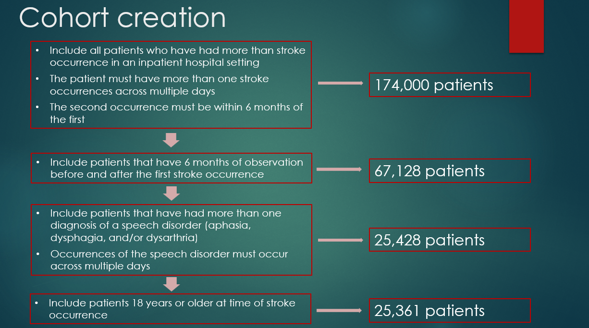

## How are stroke patients cared for in the US?:
### A statistical analysis of factors affecting the likelihood of receiving speech language treatment for aphasia, dysarthria, and dysphagia in stroke aftercare

[Slides from my presentation on 12/6/24 are located here](figs/capstone_final_presentation_casey_tilton.pdf). The slides contain full details about the goals of the project, the dataset, and the variables in the models I built.

[An R markdown file](src/analysis/stroke_cohort_analysis.Rmd) contains code to fit the models and produce the figures.

An abbreviated summary is below.

## Stakeholder

* Rob Cavanaugh, PhD, CCC-SLP
* Research Data Analyst at the Observational Health Data Sciences and Informatics Center (OHDSI) at the Roux Institute

## Study Replication

The goal of the second half of the semester was to replicate a study that analyzes guideline adherence in the treatment of speech conditions after stroke. The study used a dataset of 4,486 stroke patients in Germany who were diagnosed with specific disorders or received speech therapy. The authors built logistic and linear regression models for 6 target variables including:

1. Whether a stroke patient with a speech disorder received speech-language therapy (SLT)
2. The time gap between inpatient discharge and initiation of SLT
3. Average frequency of SLT sessions

I focused my efforts on replicating the methods and results from the 1st target variable

* Citation: Schindel D, Mandl L, Schilling R, Meisel A, Schenk L (2022) Guideline adherence in speech and language therapy in stroke aftercare. A health insurance claims data analysis.

## Dataset creation

## Cohort Description
1. Find all the condition occurrences related to stroke: **~6 million rows**
2. Filter these stroke related occurrences for only inpatient hospital visits: **~3 million rows**
3. Find the first stroke occurrence for each patient: **~174k patients**
    * The patient must have more than one stroke occurrence across multiple days, and the second stroke occurrence must be within 6 months of the first occurrence
4. Filter the dataset for patients who have 6 months of observation before and after the first stroke occurrence: **67,128 patients**
5. Add binary columns to the cohort table indicating whether each stroke patient has aphasia, dysphagia, or dysarthria: 
    * Aphasia is language disorder that affects a person's ability to understand and express written and spoken language
    * Dysphagia is a disorder associated with patients who difficulty swallowing
    * Dysarthria is a speech disorder that makes it difficult to speak clearly due to issues with the muscles that control speech
    * Inclusion of the columns indicating whether each patient has the language disorders must follow the same rules as the stroke occurrences (e.g. multiple occurrences across more than one day)
    * First occurrence of the speech disorder must take place during or after the cohort entry date (first date of stroke occurrence)

## Table 1 - Descriptive Statistics

## Results

### Model results for patients with any speech condition
For stroke patients that were diagnosed with one or more speech disorders, a recent or concurrent diagnosis of Parkinson’s Disease, insomnia, depression, paralysis, or dementia were associated with increased likelihood that the patient received speech-language therapy (SLT). Men were more likely to get SLT than women, and patients with severe strokes were more likely to get SLT than patients with milder strokes.

### Model results for patients with aphasia

For patients with aphasia, a diagnosis of Parkinson’s or paralysis were the strongest predictors of receiving SLT. A diagnoses of a migraine is associated with a decrease in the likelihood of receiving SLT.

### Model results for patients with dysphagia

For patients with dysphagia, diagnoses of Parkinson’s, paralysis, insomnia, depression, or dementia, or being a man was associated with a weak but statistically significant increase in the likelihood of receiving SLT.

### Model results for patients with dysarthria

For patients with dysarthria, a diagnoses of Parkinson's is a strong predictor of a patient receiving SLT. The coefficient of 0.6 in the model corresponds to an odds ratio of approximately 1.82, indicating an 82% increase in the odds of receiving SLT compared to patients without a Parkinson's diagnosis.

## Limitation 

* 1623 patients out of the 25,000 patients in the cohort (6.3%) did not have a CCI score and it is unclear why. I made the decision to impute the median CCI score to the rows that were missing. Is the missingness random, or does the missingness reflect something about those patients Running the model after dropping those rows affected the statistical significance and importance of some variables including the age groups

* The age variable is limited in the Pharmetrix+ database compared to the German study because patients born before or during 1937 are all binned into one year.

## Acknowledgments

* Thanks to Rob Cavanaugh for his guidance and mentorship
