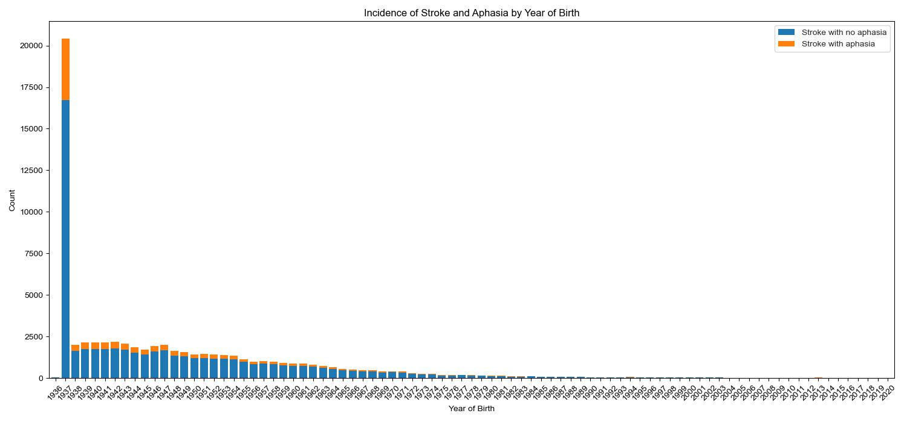
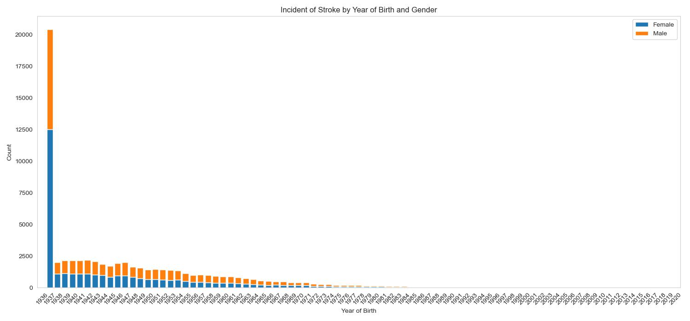
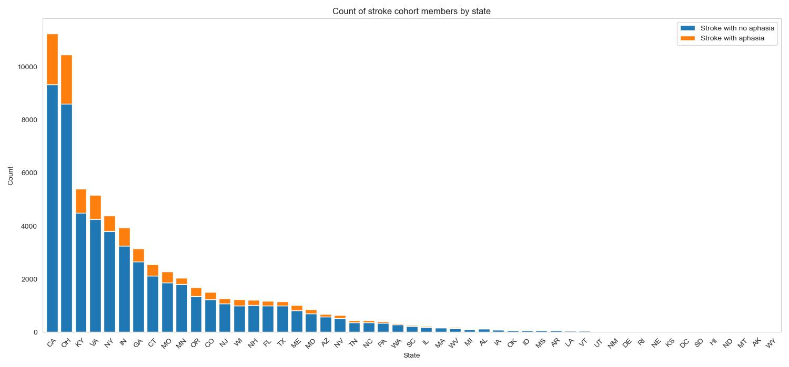
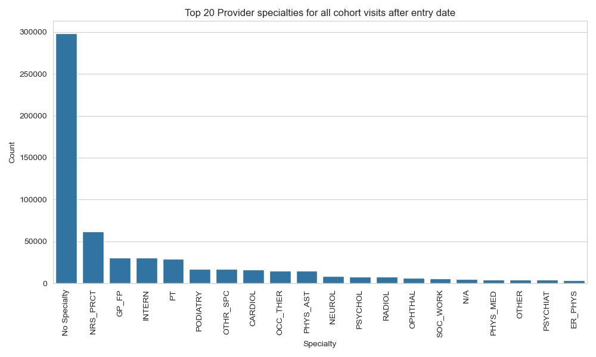
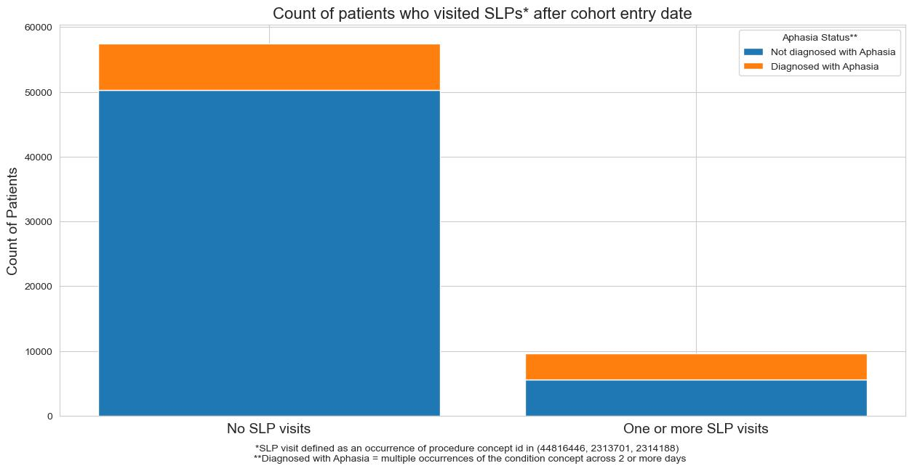
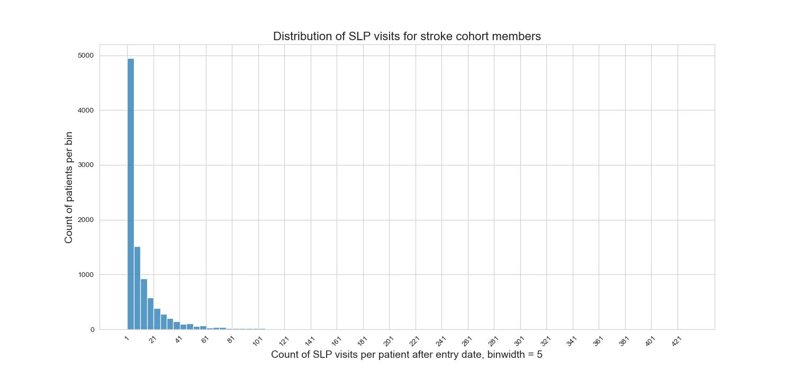
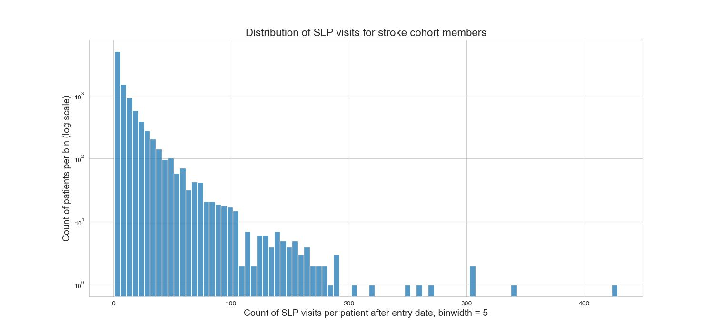
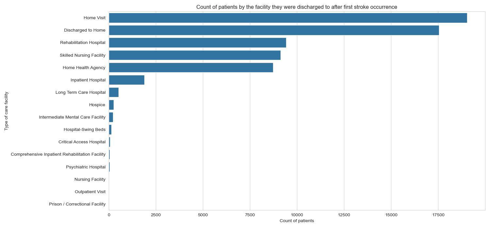

## Cohort Characterization

The risks of stroke clearly increase with age as shown by the chart below. All patients born in 1936 or earlier are aggregated into the 1937 year of birth, so unfortunately this dataset provides little insight into the exact age of approximately 30% of the entire cohort. With input from my stakeholder, I will likely bin the cohort members' year of birth into decade bins for analysis going forward. Further analysis is required to determine whether there are statistically significant differences between the incidence of aphasia for stroke patients at different ages. 

Overall, 48.4% of the stroke patient are male and 51.6% are female. However, the percentage difference is much more pronounced among the oldest patients in the cohort: of the 20,478 patients born in 1936 or earlier, 61% are female and 39% are male

The chart below displays the count of patients in each state. My hypothesis is that the enormous difference in counts between the states are due to the total number of patients covered under the health insurance plans that feed the dataset rather than anything related to stroke occurrences in different regions, but more research is required. Further analysis could also look into the differences in outcomes and care patterns across different states. 

The chart below reveals a potential data quality issue with the database. The chart displays the count of all cohort care visits recorded after the patient's first stroke broken down by the specialty of the care provider. Unfortunately, the vast majority of visits have no specialty listed. This leaves a small percentage of the dataset from which to draw insights about the type of provider that cared for patients after their stroke. I will need to use other methods and tables within the database to determine when and how many stroke patients are seen by speech language pathologists, as this is an important subset of the cohort to my stakeholder. 

